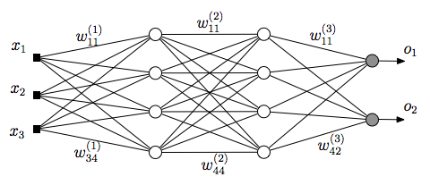

---
author:
- Vardenis Pavardenis
bibliography:
- bibliografija.bib
date: Vilnius --
title: Programų sistemų kūrimo metodų tyrimas
---

Glaustai aprašomas darbo turinys: pristatoma nagrinėta problema ir
padarytos išvados. Santraukos apimtis ne didesnė nei 0,5 puslapio.
Santraukų gale nurodomi darbo raktiniai žodžiai.

Santrauka anglų kalba. Santraukos apimtis ne didesnė nei 0,5 puslapio.

Įvade nurodomas darbo tikslas ir uždaviniai, kuriais bus įgyvendinamas
tikslas, aprašomas temos aktualumas, apibrėžiamas tiriamasis objektas
akcentuojant neapibrėžtumą, kuris bus išspręstas darbe, aptariamos
teorinės darbo prielaidos bei metodika, apibūdinami su tema susiję
literatūros ar kitokie šaltiniai, temos analizės tvarka, darbo atlikimo
aplinkybės, pateikiama žinių apie naudojamus instrumentus (programas ir
kt., jei darbe yra eksperimentinė dalis). Darbo įvadas neturi būti
dėstymo santrauka. Įvado apimtis 2--4 puslapiai.

# Medžiagos darbo tema dėstymo skyriai

Medžiagos darbo tema dėstymo skyriuose išsamiai pateikiamos nagrinėjamos
temos detalės: pradiniai duomenys, jų analizės ir apdorojimo metodai,
sprendimų įgyvendinimas, gautų rezultatų apibendrinimas.

Medžiaga turi būti dėstoma aiškiai, pateikiant argumentus. Tekste
dėstomas trečiuoju asmeniu, t.y. rašoma ne "aš manau", bet „autorius
mano", „autoriaus nuomone". Reikėtų vengti informacijos nesuteikiančių
frazių, pvz., „\...kaip jau buvo minėta\...", „\...kaip visiems
žinoma\..." ir pan., vengti grožinės literatūros ar publicistinio
stiliaus, gausių metaforų ar panašių meninės išraiškos priemonių.

Skyriai gali turėti poskyrius ir smulkesnes sudėtines dalis, kaip
punktus ir papunkčius.

## Poskyris

Citavimo pavyzdžiai: cituojamas vienas šaltinis [@PvzStraipsnLt];
cituojami keli šaltiniai
[@PvzStraipsnEn; @PvzKonfLt; @PvzKonfEn; @PvzKnygLt; @PvzKnygEn; @PvzElPubLt; @PvzElPubEn; @PvzMagistrLt; @PvzPhdEn].

## Faktorialo algoritmas

[\[alg:factorial\]](#alg:factorial){reference-type="ref"
reference="alg:factorial"} pav. pateiktas faktorialo algoritmas.

::: algorithm
::: algorithmic
$N\gets$ skaičius, kurio faktorialą skaičiuojame $F\gets 1$
$F\gets F \cdot i$
:::
:::

### Punktas

### Punktas

# Skyrius

## Poskyris

## Poskyris

Rezultatų ir išvadų dalyje išdėstomi pagrindiniai darbo rezultatai
(kažkas išanalizuota, kažkas sukurta, kažkas įdiegta), toliau
pateikiamos išvados (daromi nagrinėtų problemų sprendimo metodų
palyginimai, siūlomos rekomendacijos, akcentuojamos naujovės).
Rezultatai ir išvados pateikiami sunumeruotų (gali būti hierarchiniai)
sąrašų pavidalu. Darbo rezultatai turi atitikti darbo tikslą.

Sąvokų apibrėžimai ir santrumpų sąrašas sudaromas tada, kai darbo tekste
vartojami specialūs paaiškinimo reikalaujantys terminai ir rečiau
sutinkamos santrumpos.

# Neuroninio tinklo struktūra

{#img:mlp}

# Eksperimentinio palyginimo rezultatai

::: {#tab:table example}
  Algoritmas      $\bar{x}$   $\sigma^{2}$
  -------------- ----------- --------------
  Algoritmas A     1.6335        0.5584
  Algoritmas B     1.7395        0.5647

  : Lentelės pavyzdys
:::

[\[tab:table example\]]{#tab:table example label="tab:table example"}
